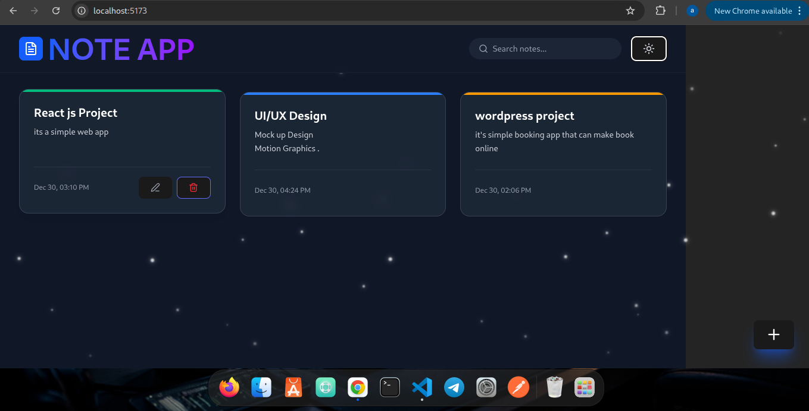

# 🧠 React.js Notes App

### Smooth • Interactive • Modern UI

A modern **Notes Application built with React.js** that focuses on **clean design**, **smooth animations**, and **excellent user experience**.  
This project demonstrates strong React fundamentals using hooks, responsive layouts, and modern UI patterns inspired by productivity apps.

---

<p align="center">
  
</p>

<!-- ## ✨ Live Preview

🚀 *Coming Soon*
(Deploy easily using **Vercel**, **Netlify**, or **GitHub Pages**) -->

---

## 🌟 Features

📝 Add notes with title & content  
✏️ Edit notes inline or via modal  
🗑️ Delete notes with smooth animations  
💾 Auto-save notes to `localStorage`  
🔍 Search notes by title or content  
📅 Timestamp for each note  
📊 Character limit indicator  
➕ Floating “Add Note” button  
🌗 Optional Dark / Light mode  
📱 Fully responsive (Mobile • Tablet • Desktop)  
🎭 Beautiful empty-state UI when no notes exist

---

## 🎨 UI / UX Highlights

- Soft shadows & rounded corners
- Smooth spacing & calm color palette
- Micro-interactions (hover, scale, ripple effects)
- Fade + slide animations for add/remove actions
- Clean typography inspired by modern productivity tools
- Optional Framer Motion animations

---

## 🧩 Tech Stack

⚛️ **React.js**  
🧠 React Hooks (`useState`, `useEffect`)  
🎨 Tailwind CSS / CSS Modules / Styled Components  
🎞️ Framer Motion (optional)  
💾 Browser `localStorage`

---

## 📁 Project Structure

```folder
note-app-With-React/
│
├── src/
│ │
│ ├── App.jsx
│ ├── main.jsx
│ ├── styles/
│ └── utils/
│
├── public/
├── package.json
└── README.md
```

---

## ⚙️ Installation Guide

### 1️⃣ Install Node.js

```bash
Download and install **Node.js (LTS)**
👉 https://nodejs.org
```

Verify installation:

```bash
node -v
npm -v
```

## 2️⃣ Create React App (Vite Recommended)

```bash
npm create vite@latest react-notes-app
cd react-notes-app
npm install
```

## 3️⃣ Install Optional Dependencies

```bash
npm install framer-motion
npm install -D tailwindcss postcss autoprefixer
```

## 4️⃣ Run the App

```bash
npm run dev
```

Open browser:

```bash
http://localhost:5173
```

## 🧠 How It Works

- Notes are stored in localStorage

- React state syncs with storage using useEffect

- UI updates instantly with smooth transitions

- Search filters notes in real time

- Animations enhance UX without performance loss

## 🌱 Future Enhancements

- ☁️ Cloud sync (Firebase / Supabase)
- 🔐 User authentication
- 🏷️ Tags & categories
- 📌 Pin important notes
- 📤 Export notes (PDF / TXT)
- 🧠 AI note summarization

## 🧪 Best Practices Used

✔️ Functional components
✔️ Clean state management
✔️ Reusable UI components
✔️ Responsive design
✔️ Accessibility-friendly layout

## 📜 License

📄 MIT License
Free to use, modify, and share.

## 👨‍💻 Author

Daniel Melese
Full-Stack Developer
